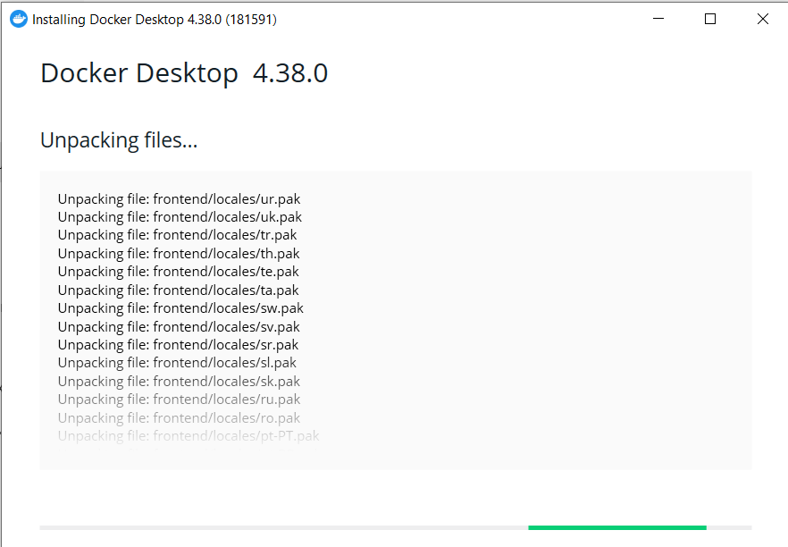
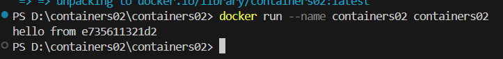
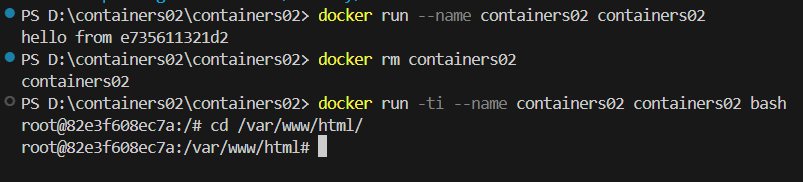
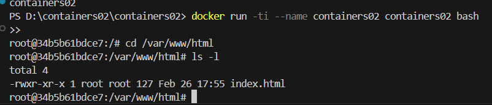

# Лабораторная работа #3. Первый контейнер

## Выполнил

**Mihailov Piotr I2302**
***Дата выполнения: 01.03.25***

## Цель работы

Ознакомиться с базовыми принципами работы с Docker, научиться создавать и управлять контейнерами, а также копировать файлы в контейнер

## Задание

Для начала нам нужно установить и настроить DockerDesktop, создать репозиторий `containers02` и склонировать его на локальный компьютер.

Далее нам нужно подготовить DockerFile для создания контейнера. После необходимо создать папку `site` с файлом `index.html`.

После выполнения данных манипуляций, необходимо создать образ и запустить контейнер, а также проверить его содержимое и выполнить тестирование.

## Выполнение работы

## Установка DockerDesktop

Необходимо скачать и установить DockerDesktop на мой компьютер.


DockerDesktop был успешно установлен и проверен командой:

```bash
docker --version
```

## Создание репозитория и его клонирование. Подготовка файлов

Далее был создан репозиторий `containers02` и был склонирован на мой компьютер.

В папке `containers02` создаю `DockerFile` и в него было введено следующее содержимое

```DockerFile
FROM debian:latest
COPY ./site/ /var/www/html/
CMD ["sh", "-c", "echo hello from $HOSTNAME"]
```

В этой же папке была создана папка `site`. В данной папке я создал `index.html` с произвольным содержимым.

## Создание образа

Далее, мне нужно создать образ. Для этого я ввел следующую команду

```DockerFile
docker build -t containers02 .
```

По времени этот образ у меня на компьютере создавался 31.9 секунд.

## Запуск контейнера

Для запуска контейнера, мне нужно ввести следующую команду:

```bash
docker run --name containers03 containers03
```

В результате выполнения данной команды, в терминале у меня вывелось следующее сообщение:


Далее, я удаляю контейнер и запускаю его снова, для этого я ввел следующие команды:

```bash
docker rm containers03
docker run -ti --name containers03 containers03 bash
```



Далее, я выполняю следующие команды, для того, чтобы посмотреть наличие файлов с их подробностями

```bash
cd /var/www/html/
ls -l
```

В результате в терминале у меня вывелись следующие данные


- -rwxr-xr-x — права доступа: владелец (root) может читать, записывать и выполнять (rwx), группа может читать и выполнять (r-x), остальные тоже могут читать и выполнять (r-x).
- 1 — количество ссылок на файл.
- root root — владелец и группа.
- 127 — размер файла в байтах.
- Feb 26 17:55 — дата и время последнего изменения.
- index.html — имя файла.

Далее с помощью команды `exit` выхожу из терминала.

### Выводы

Благодаря данной лабораторной работе, были получены базовые навыки работы с Docker, был создан и протестирован контейнер с Debian.

Данная лабораторная работа хорошо помогает и учит базовым навыкам для дальнейшей работы в данной среде.

### Библиография

- [Официальная документация Docker](https://docs.docker.com/)
- [Repository by M.Croitor](https://github.com/mcroitor/app_containerization_ru)
